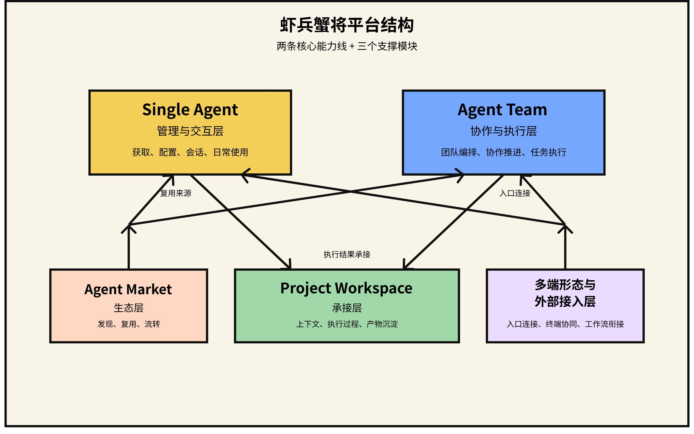
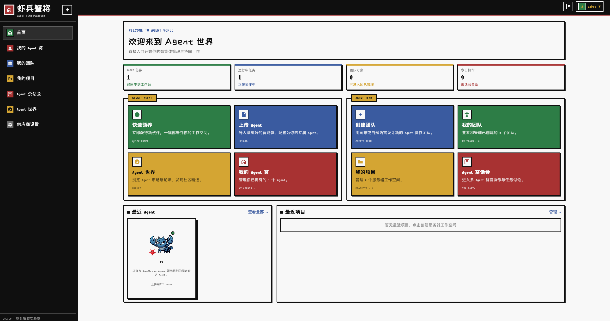
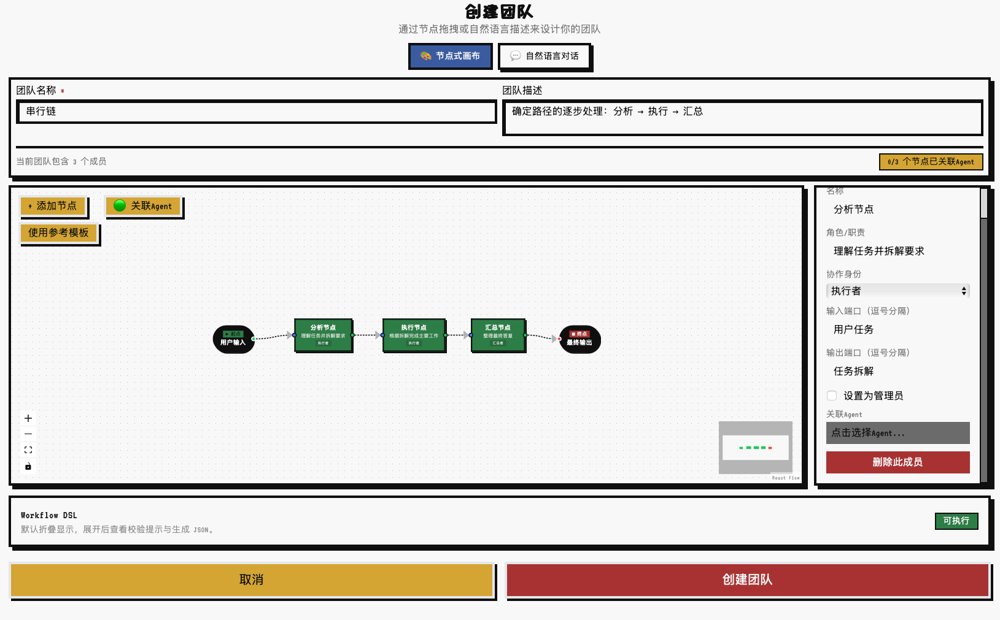
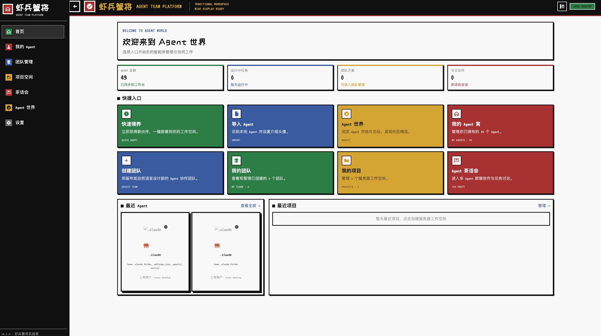
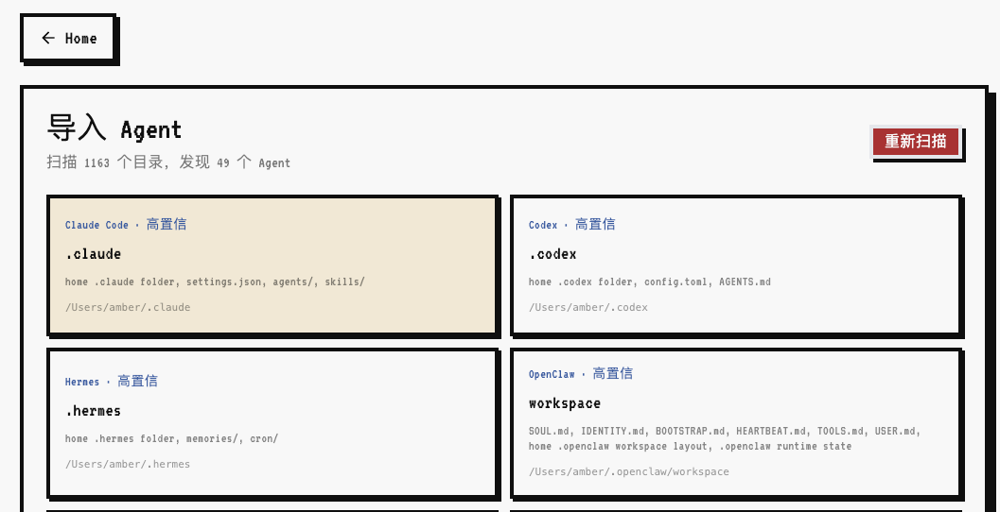
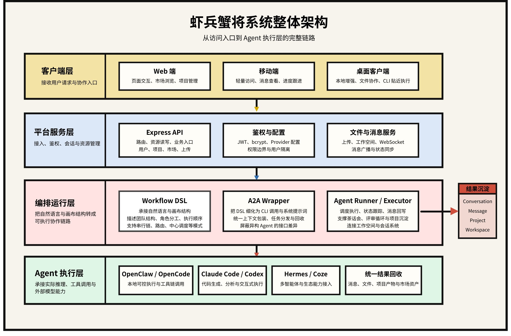
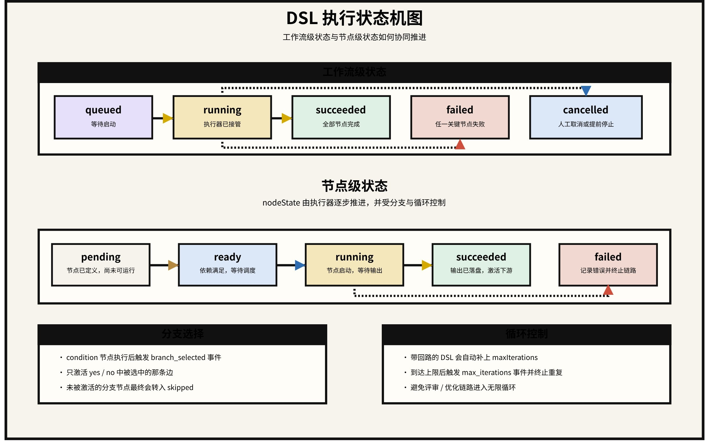
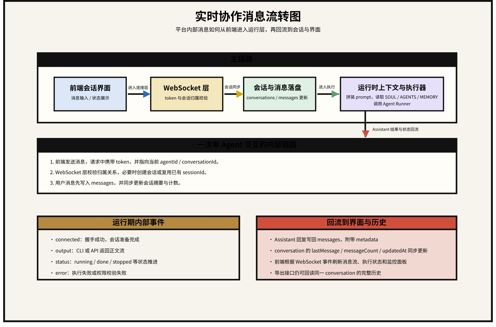
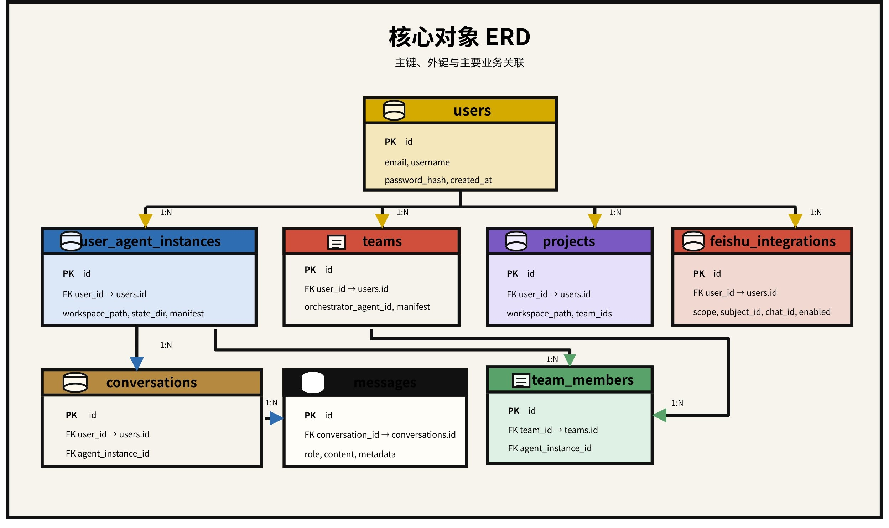

# ShrimpCrab · 虾兵蟹将

[简体中文](README.md) | [English](README.en.md)

<p align="center">
  
</p>

<p align="center">
  面向复杂知识工作的多 Agent 协作平台
</p>

<p align="center">
  <a href="http://121.40.242.77/">在线体验</a> ·
  <a href="https://my.feishu.cn/wiki/XioNwVrxOiYDy5kiwOtcUWdjnFb">产品文档</a> ·
  <a href="https://my.feishu.cn/wiki/ToFZwV492ilwqEkxRgGckd65nSc">技术文档</a>
</p>

## 一句话介绍

ShrimpCrab 是一个面向复杂知识工作的多 Agent 协作平台，统一承载单 Agent 使用、多 Agent 团队编排与 Project Workspace 沉淀。

## 它解决什么问题

很多 AI 产品能回答问题，但很难承接真实工作：能力分散、协作结构不可见、结果不沉淀、上下文难复用。ShrimpCrab 关注的不是“再做一个聊天框”，而是把能力获取、团队编排、任务执行和结果沉淀串成一条完整工作链路。

它主要面向两类场景：

- 需要快速调用单个 Agent 完成具体任务的日常使用场景
- 需要多个 Agent 分工协作、持续推进并沉淀产物的复杂知识工作场景

## 产品架构



产品由两条核心能力线和三个支撑模块构成：

- **Single Agent**：负责 Agent 的获取、配置、会话与日常使用
- **Agent Team**：负责多 Agent 的组织、编排、协作推进与任务执行
- **Project Workspace**：负责承接上下文、执行过程、日志与产物沉淀
- **Agent Market**：负责能力发现、复用与流转
- **Multi-surface & Integrations**：负责 Web、移动端、桌面端以及飞书等外部入口

这 5 个模块对应一条完整使用路径：先获得能力，再组织协作，最后把过程和结果沉淀为可继续复用的工作资产。

## 核心使用路径

1. 从 Agent Market 领养现成 Agent，或上传自己的 Agent。
2. 在 Single Agent 模式下完成配置、试运行和独立会话。
3. 把多个 Agent 组织成 Team，通过自然语言或画布进行编排。
4. 通过 Workflow 执行复杂任务，把消息、文件、日志和产物沉淀到 Project Workspace。
5. 在桌面端、本地导入和外部协作入口中继续复用这些能力资产。

## 产品截图

### 首页



### 团队画布编排



### 桌面端



### 本地 Agent 导入



## 技术架构

从实现上看，ShrimpCrab 采用分层协作架构：

- **Client Layer**：Web、移动端、桌面端
- **Platform Service Layer**：Express API、鉴权、文件服务、Provider 管理、市场与集成接口
- **Orchestration Runtime Layer**：Workflow DSL、A2A Wrapper、Workflow Executor、Agent Runner
- **Agent Execution Layer**：OpenClaw、Claude Code、Codex、Hermes、OpenCode、Coze 等执行端
- **Persistence Layer**：SQLite、会话消息、项目空间、运行目录、产物与日志

### 系统整体架构



### 产品模块与技术层的对应关系

- `Single Agent`：Agent 管理接口、Provider 配置、会话系统、运行时调度
- `Agent Team`：Workflow DSL、A2A Wrapper、Executor
- `Project Workspace`：项目模型、工作目录、运行目录、产物目录
- `Agent Market`：市场资源模型、下载/复用链路、发布流程
- `Multi-surface & Integrations`：多端 UI、桌面壳层、飞书接入

### DSL 执行状态机



### 实时消息流转



### 核心对象 ERD



## 技术栈

| 层级 | 技术选型 |
| --- | --- |
| 前端 | Next.js 14、React 18、TypeScript、Tailwind CSS、Framer Motion、Zustand、`@xyflow/react` |
| 后端 | Node.js 22、Express、TypeScript、WebSocket (`ws`) |
| 数据层 | SQLite、`better-sqlite3`、Drizzle ORM |
| 鉴权 | JWT、`bcryptjs` |
| 文件与上传 | `multer`、本地文件系统工作空间 |
| 桌面端 | Electron |

## 仓库结构

```text
.
├── backend/                  # Express API、Workflow 运行时、SQLite、WebSocket
├── next-lobster-platform/    # Next.js Web / Mobile 前端
├── openclaw-desktop-client/  # Electron 桌面端
├── docs/                     # 产品/技术文档与 README 素材
├── diagrams/                 # 图示与设计产物
└── claw_profile/             # 角色头像与像素素材
```

## 快速开始

### 环境要求

- Node.js 22+
- npm
- macOS / Linux / Windows / WSL

### 启动后端

```bash
cd backend
cp .env.example .env
npm install
npm run dev
```

默认端口：

- REST API：`http://localhost:3002`
- WebSocket：`ws://localhost:3003`

### 启动前端

```bash
cd next-lobster-platform
cp .env.example .env.local
npm install
npm run dev
```

默认地址：

- Web：`http://localhost:3000`

### 启动桌面端（可选）

```bash
cd openclaw-desktop-client
npm install
npm run dev
```

## 相关文档

- [产品文档](https://my.feishu.cn/wiki/XioNwVrxOiYDy5kiwOtcUWdjnFb)
- [技术文档](https://my.feishu.cn/wiki/ToFZwV492ilwqEkxRgGckd65nSc)
- [`docs/agent-platform-prd.md`](docs/agent-platform-prd.md)
- [`backend/DEPLOY.md`](backend/DEPLOY.md)

## 当前边界

- 公网演示中的部分流程需要登录后才能完整体验
- Agent 执行依赖 OpenClaw、Codex、Claude Code、Hermes、OpenCode 等外部或本地 CLI 运行时
- 当前持久化以 SQLite 为主，适合快速迭代与轻量部署
- 仓库已经覆盖产品主骨架、工作流编排链路、项目空间模型和多入口 UI
